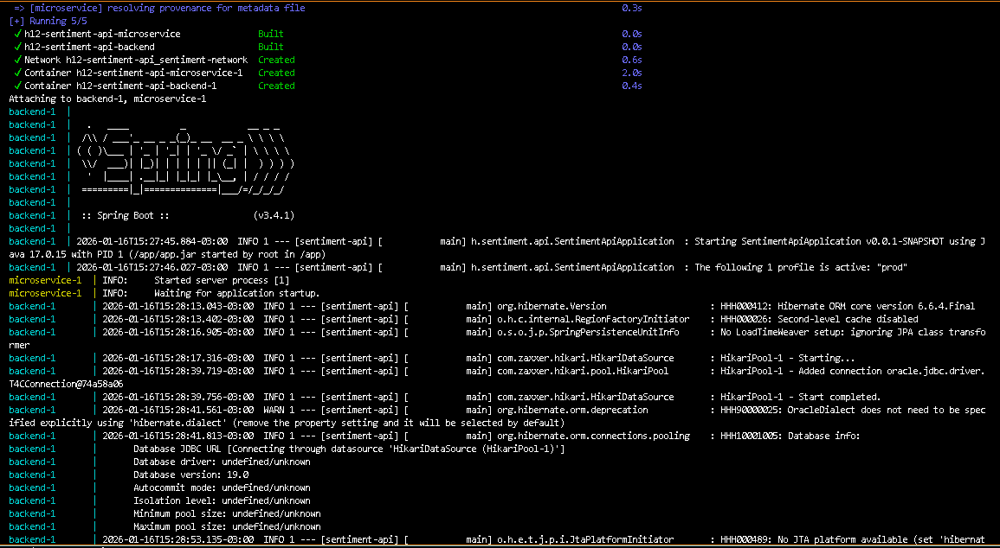
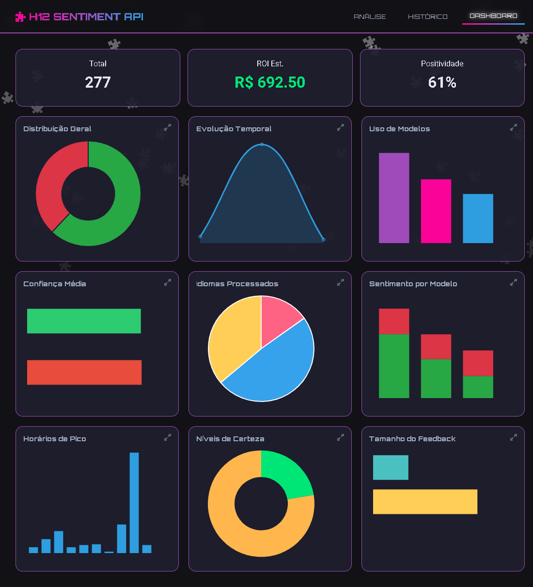

<div align="center">

# H12 - Enterprise Customer Intelligence
### De Feedback Bruto para Decisões Estratégicas via IA

-17-6DB33F?style=for-the-badge&logo=spring&logoColor=white)
-3.9-3776AB?style=for-the-badge&logo=python&logoColor=white)


</div>

---

## 1. O Desafio de Negócio

Empresas de escala global recebem milhares de feedbacks de clientes diariamente através de múltiplos canais. A análise manual desse volume de dados é impraticável, resultando na perda de **insights valiosos** e no aumento do **risco de churn**. A incapacidade de agir rapidamente sobre a percepção do cliente é uma desvantagem competitiva crítica.

**A Solução H12** ataca este problema diretamente. Nossa plataforma utiliza uma arquitetura de **Microserviços** e **Processamento de Linguagem Natural (NLP)** para analisar, categorizar e transformar feedback bruto em inteligência acionável em **tempo real**, permitindo que as organizações tomem decisões imediatas e baseadas em dados.

---

## 2. Arquitetura de Software (Senior Level)

A robustez da plataforma H12 reside em sua arquitetura de software, projetada para **escalabilidade**, **resiliência** e **manutenibilidade**.



- **Desacoplamento Estratégico:** A arquitetura separa o **Backend Transacional** (Java 17, Spring Boot), responsável pela lógica de negócio e persistência, do **Motor de Inferência de IA** (Python, FastAPI). Isso permite que cada sistema escale e evolua de forma independente.
- **Resiliência e Portabilidade com Docker:** Toda a solução é containerizada com **Docker** e orquestrada via **Docker Compose**, garantindo um ambiente de implantação consistente, resiliente e facilmente portátil entre ambientes de desenvolvimento, teste e produção.
- **Integração Nativa com Oracle Autonomous Database:** O H12 utiliza o **Oracle Autonomous Database** como camada de persistência, beneficiando-se de escalabilidade automática, alta disponibilidade e os mais altos padrões de segurança de dados, fundamentais para uma solução de nível enterprise.
- **Design Patterns e Código Limpo:** O backend Spring Boot foi desenvolvido utilizando **DTOs (Data Transfer Objects)** e uma clara **Service Layer**, garantindo um código limpo, testável e de fácil manutenção, seguindo as melhores práticas da indústria.

---

## 3. Analytics & Tomada de Decisão

A plataforma transforma dados em insights através de um **Painel de Comando para Gestores**, desenvolvido com Chart.js.



- **Painel de Comando:** Mais do que simples gráficos, o dashboard oferece uma visão centralizada e em tempo real do sentimento do cliente, permitindo que líderes identifiquem tendências e anomalias instantaneamente.
- **Auditoria e Rastreabilidade de Dados:** Cada análise de sentimento é registrada, criando um histórico completo que serve como uma trilha de auditoria. Essa funcionalidade é crucial para a rastreabilidade e para análises de tendências de longo prazo.

---

## 4. Matriz de Performance de IA (Transparência Estratégica)

Oferecemos transparência total sobre a performance dos nossos modelos de IA, que são especializados por idioma para máxima eficácia.

| Idioma | Acurácia Média | Detalhes do Modelo |
| :--- | :---: | :--- |
| 🇺🇸 **Inglês (English)** | **~98%** | Modelo otimizado com fine-tuning para alta precisão. |
| 🇧🇷 **Português (Portuguese)** | **~93%** | Treinado com o dataset brasileiro B2W de e-commerce. |
| 🇪🇸 **Espanhol (Spanish)** | **~85%** | **Nota:** Modelo MVP generalista focado em escalabilidade inicial; pronto para *Fine-Tuning* com datasets proprietários. |

---

## 5. Roadmap de Evolução (v2.0)

O H12 foi projetado para evoluir. Nossas features prioritárias para a próxima versão visam suportar o processamento de **Big Data** e fortalecer a segurança para ambientes multi-tenant.

- **Paginação Server-Side:** Implementação no backend Java para manipular de forma eficiente dezenas de milhões de registros de feedback.
- **Autenticação OAuth2:** Adoção do padrão OAuth2 para proteger as APIs e permitir a integração segura com outros sistemas corporativos.

---

## 6. Instalação e Execução

Graças à containerização completa, a implantação da plataforma é um processo unificado e direto.

**Pré-requisito:** Docker e Docker Compose.

Na raiz do projeto, execute:
```shell
docker compose up --build
```
Este comando orquestra o build e a execução de todos os microserviços.

- **Frontend:** Abra `frontend/index.html` em seu navegador.
- **API Backend (Java):** `http://localhost:8080/sentiment`
- **IA Microservice (Python):** `http://localhost:8000/docs` (Swagger UI)

---

## 7. 👥 Equipe H12-25-B-Equipe 07

#### 🏗️ Tech Lead & Fullstack
- **Cidirclay Santos de Lima Queiroz** - Arquitetura de Containers, Dockerização e Integração entre Squads.

#### 🧠 Data Science Squad
- **Moisés Ribeiro dos Santos Junior** - Treinamento de Modelos e Avaliação.
- **Daniel Farney Moura Moreira** - Notebooks e Otimização.
- **Lidia Lapertosa** - Validação de modelos e suporte a dados em Espanhol.
- **Rayra Bandeira de Mello Gomes Dias** - Pesquisa e Limpeza de Dados.

#### ⚙️ Backend Squad
- **Ailson Moreira** - Implementação de Services e Controllers.
- **Leandro Fernandes Moraes** - WebClient e Integração Reativa.
- **Ana Fernandez Cruz** - Validações e DTOs e Apresentação.


---

<div align="center">
Desenvolvido para o Hackathon NoCountry 2024.
</div>